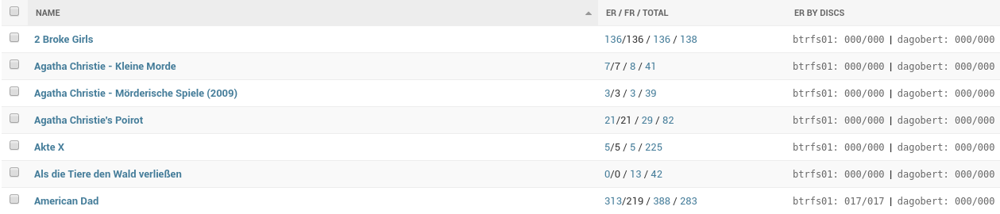
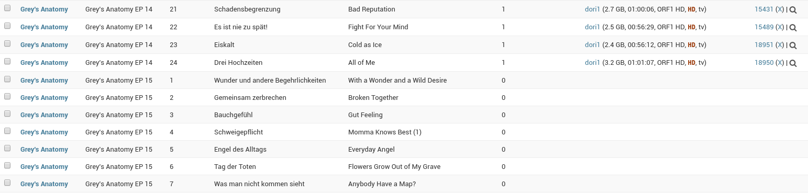

# Media Manager

*Media Manager* is a Django Web App to manage your recorded TV Shows. It can act as an endpoint for TVHeadend's DVR. 

## Features

- Scraper (= where we get the episode numbers and titles from) for [TMDB](https://themoviedb.org)
- Scraper for [Fersehserien.de](https://fernsehserien.de)
- can assign episode nr and seasons nr via episode title
- supports mkv metadata
- your media can lay across different storage's, i.e. episodes of one show spreaded on different harddisc's

## Screenshots

List your DVR recorded TV shows:

List your Episodes:

## Installation

1. create python 2 venv and install ckw-mediamanager
2. `(mediamanager)christian@nzxt:~/workspace/venvs/mediamanager$ pip install -e ~/src/ckw-mediamanager`
3. `(mediamanager) christian@nzxt:~/workspace/venvs/mediamanager$ pip install django==1.11.9`
4. get your [API Key (v3 auth)](https://www.themoviedb.org/settings/api) and set it in `settings.py` (var `TMDB3_KEY`)

## settings.py

    ...
    TMDB3_KEY = "<Your Api Key here>"
    INSTALLED_APPS += [
        'background_task',
        'mediamanager',
    ]
    ROOT_URLCONF = 'mm.urls'
    
    # Background Tasks
    MAX_RUN_TIME = 14400  # 4h
    BACKGROUND_TASK_ASYNC_THREADS = 1
    MAX_ATTEMPTS = 1
    
    ...

## Usage

Start:

    screen -S mm
    
Screen 1:

    cd ~/workspace/venvs/mediamanager
    source bin/activate
    python mm/manage.py process_tasks --queue disk-move-<Name of Storage Device>

Screen 2:

    cd ~/workspace/venvs/mediamanager
    source bin/activate
    python mm/manage.py runserver 0.0.0.0:9003

Resume:

    screen -r mm

Tabs:

    1.: Shows               http://0.0.0.0:9003/admin/mediamanager/show/
    2.: Show storages       http://0.0.0.0:9003/admin/mediamanager/showstorage/
    3.: Episode resources   http://0.0.0.0:9003/admin/mediamanager/episoderesource/
    4.: Show episodes       http://0.0.0.0:9003/admin/mediamanager/showepisode
    5.: File resources      http://0.0.0.0:9003/admin/mediamanager/fileresource/

    x.: Tasks               http://0.0.0.0:9003/admin/background_task/task/
